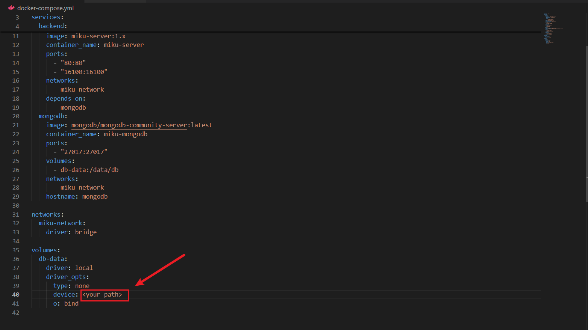

It's base on a open source project about a certain anime game(https://github.com/MikuLeaks/MikuBH3-PS)

## Preparation for deployment

### Windows OS

You only need install the [Docker Desktop](https://docs.docker.com/desktop/install/windows-install/).
Of course, I suggest you install [WSL2](https://learn.microsoft.com/en-us/windows/wsl/install) and [Windows Terminal](https://learn.microsoft.com/en-us/windows/terminal/install) to make it work better.

### Linux OS

well, you seems very good at computer technology, so I believe you don't need any tutorials and anybody help, and you can modify the configs to make them adapt the linux easily. (≖ ‿ ≖)✧

## build & start

1. modify file `docker-compose.yml`, replace the `<your path>` to the path you want to mount the mongodb's data.
   
2. open this folder with **power shell**
3. run `docker compose up`
   **PS:if you use windows os, you could wirte the path as `/c/folder/subfolder`(the original path string is`C:\folder\subfolder`)**

## stop or restart

After run `docker compose up`, you can stop it by this way.

### function 1

1. open this folder with **power shell**
2. run `docker compose stop` to stop it
3. after that, you cloud run `docker compose start` to restart it

### function 2

If you don't want to maintain the containers after stopped to save storage, you could use the command `docker compose down -v` instead, then it's not only stop containers but also delete all things created by the compose.(don't worry, the mongodb's data will not be removed in your computer, because it was mounted by step 1 in **build & start**)
And you can run `docker compose up` start it again.
